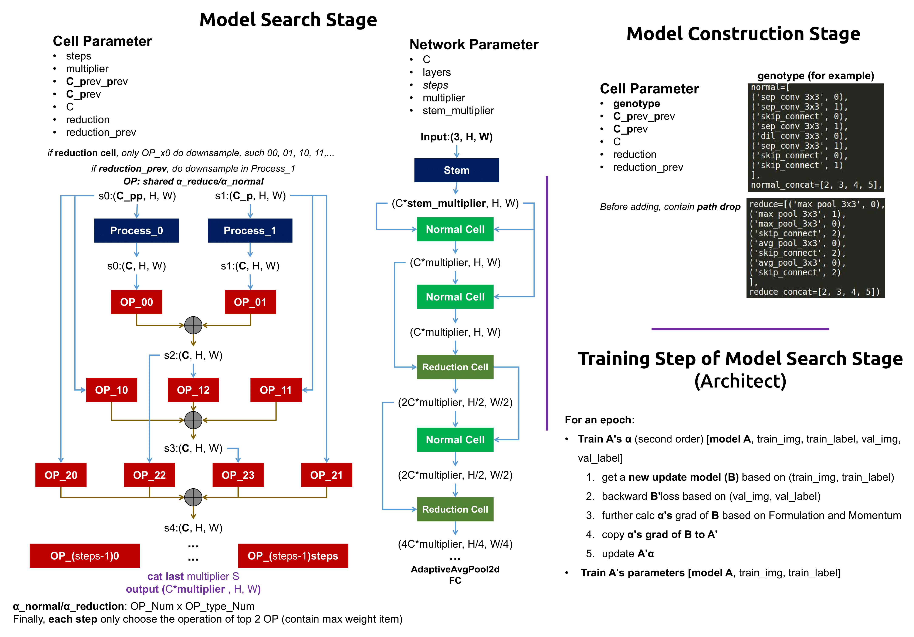

# Differentiable Architecture Search on ChestX-Ray14 Toy Set
- Modified based on the [**Code**](https://github.com/quark0/darts) of **quark0**.
- The paper is called [**DARTS: Differentiable Architecture Search**](https://arxiv.org/abs/1806.09055)


## Statement
- This repository is used for learning **Darts**. I summary the procedures of Darts in **search stage** and **val stage** (please see the figure below).
- I modify the original code and run it on [**ChestX-Ray14**](https://nihcc.app.box.com/v/ChestXray-NIHCC) Toy Set, which is sampled by myself (as it's too slow to train Darts on large datasets).
- **CheXNet** is selected as baseline.

## Environment
- python 3.7.3
- pytorch 1.1.0


## Running Steps
1. Select order (first or second) in **search_train.py**.
    ```
	SECOND_ORDER = True
	
2. Run **search_train.py**, then **genotype.txt** will be generated in **search_XX_order/**.
3. Select order and Run **val_train.py**, then weights **.pth** will be saved in **weights/**.
4. Select order and Run **test.py**.

## Summary


## Comparison
- The Metric is **AUC**.
- The **Optimizer** can be changed to get better performance maybe (when I use Adam, Darts achieves about 0.70 average AUC and 6.3 MB. On the other hand, ChestX-Ray14 dataset is sensitive to learning rate. Setting different LR (0.001/0.0001) of Adam can get different results).
- The **second order** version of Darts haven't been tested, as it's extremely slow.

Method            	| CheXNet   	| Darts (first order)
---                    	| ---            	| --- 
**Parameter**	    | 6.97MB	| 7.34MB
Atelectasis      	| 0.685		| 0.667
Cardiomegaly 	| 0.779 		| 0.769
Effusion           	| 0.788 		| 0.742
Infiltration       	| 0.669 		| 0.648
Mass               		| 0.734 		| 0.654
Nodule               	| 0.655 		| 0.588
Pneumonia             	| 0.681 		| 0.578
Pneumothorax	| 0.797  		| 0.709
Consolidation		| 0.715 		| 0.677
Edema			| 0.783 		| 0.758
Emphysema		| 0.767 		| 0.647
Fibrosis			| 0.689 		| 0.638
Pleural_Thickening	| 0.682 		| 0.642
Hernia			| 0.876 		| 0.814
**Average**	    | 0.736		| 0.681

## Update Records
None